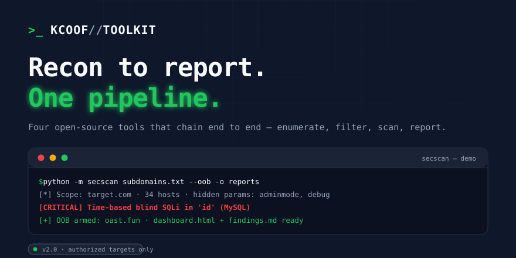

  

<h3 align="center">Cybersecurity Engineer · CEH · M.Tech Offensive Security &amp; AI Automation — Saudi Arabia</h3>

  
  
  
  
  

---

## PHANTOM — web application security testing platform

[**PHANTOM**](https://github.com/Kcoof/PHANTOM) is an open-core alternative to Burp Suite that runs entirely on your machine. It captures traffic between your browser and the applications you test, and gives you an intercepting proxy, repeater, intruder, a vulnerability scanner with 12 passive and active checks, and four focused hunting plugins (hidden parameters, CORS misconfigurations, risky HTTP methods, sensitive paths). Built with FastAPI, mitmproxy, React, and Electron.

What makes it different: every module is connected — right-click a request to send it anywhere — findings link back to the request and forward to an AI assistant for analysis, and all data stays local in SQLite. No traffic leaves your computer except what you deliberately send.

---

## The Bug Bounty Toolkit

A recon-to-report pipeline for web application testing. Four stages, one command each:

| Stage | Tool | What it does | Command |
|:-:|---|---|---|
| **01 — RECON** | [**SUBenum**](https://github.com/Kcoof/SUBenum) | 5 passive sources, DNS bruteforce with wildcard detection, alive-host probing | `subenum -d target.com -probe` |
| **02 — FILTER** | [**xss**](https://github.com/Kcoof/Xss) | Mass reflection pre-filter across huge URL lists at machine speed | `xss -l urls.txt -o hits.txt` |
| **03 — SCAN** | [**secscan**](https://github.com/Kcoof/security-scanner) | Context-aware XSS, 3-mode SQLi, CORS, CRLF, open redirect, blind OOB via Interactsh | `secscan subs-alive.txt --oob` |
| **04 — REPORT** | findings | HTML dashboard + HackerOne-ready Markdown with CWE and remediation | `start dashboard.html` |

Also in the kit: [wordlist](https://github.com/Kcoof/wordlist) (1M+ curated entries for subdomains, parameters, paths) · [SentinelDork](https://github.com/Kcoof/sentineldork) (dork templates for exposed assets, with optional GLM-powered risk analysis through a serverless proxy).

<b>secscan detection coverage</b>

| Check | Severity | CWE |
|---|---|---|
| Reflected XSS (context-aware: body / attribute / JS / comment) | High | CWE-79 |
| SQLi — error-based (MySQL, PostgreSQL, MSSQL, Oracle, SQLite) | Critical | CWE-89 |
| SQLi — boolean-based blind (response diffing) | Critical | CWE-89 |
| SQLi — time-based blind (real latency measurement) | Critical | CWE-89 |
| DOM XSS via headless Chromium (`--dom`) | High | CWE-79 |
| Open redirect (Location header + client-side) | Medium | CWE-601 |
| CORS misconfiguration (Origin reflection, null, subdomain tricks) | Med–High | CWE-942 |
| CRLF injection (params + path) | Medium | CWE-93 |
| Host header / X-Forwarded-Host injection | Medium | CWE-644 |
| Clickjacking, cookie flags, security headers | Low–Med | CWE-1021/1004/693 |
| Out-of-band callbacks — blind SSRF/SQLi/XSS via Interactsh | High | CWE-918 |

---

## AI products I'm building

- [**AI اليوم**](https://github.com/Kcoof/ai-today) — a daily Arabic AI newsletter that writes itself. GitHub Actions runs daily at 06:00 UTC, fetches 19 sources, GLM curates and writes the Arabic summaries, commits the edition as JSON, and Cloudflare Pages publishes it. Zero manual steps.
- [**KNOCK**](https://github.com/Kcoof/knock) — a multiplayer pixel-art world where builders walk through hubs, knock on each other's doors, and talk or collaborate in real time. Phaser + Next.js + Supabase realtime presence + WebRTC voice, with mobile controls. Ten shipped phases from auth to voice.

---

## What I do

**Offensive security** — web application penetration testing, OWASP Top 10, SQL injection, XSS, authentication and business-logic flaws, API security.

**Security tooling** — Python and Go: scanners, recon automation, pipeline integrations. Tools that scale manual testing rather than replace the tester.

**AI automation** — LLM-assisted vulnerability analysis, vision extraction, agent architecture for security workflows.

Currently targeting senior cybersecurity roles in Saudi Arabia while building security and AI tooling under **SamTechnology**.

---

## Certifications

- Certified Ethical Hacker (CEH)
- Master of Technology (M.Tech)
- Preparing: CISSP · ISO 27001 · CISM

---

  
  

---

Cybersecurity is moving past purely manual testing. My mission: engineer systems that think like attackers but operate at machine speed.

> All tooling is for **authorized security testing only** — programs you're registered with, or targets with written permission. Scope enforcement and rate limiting are built in; respecting each program's policy is on you.
